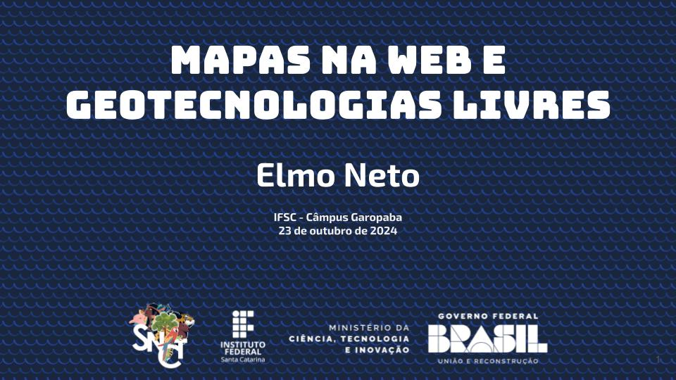

# Materiais da apresentação "Mapas na Web e Geotecnologias Livres"

## Evento: Semana Nacional de Ciência e Tecnologia do IFSC Câmpus Garopaba

Código disponível:

```primeiro-mapa``` Código do primeiro mapa da prática com o objetivo de criar um informativo para a calourada do IFSC de Garopaba, com lugares interessantes para visitar e agregar à rotina da vida estudantil (aceito sugestões para adicionarmos e disponibilizarmos esse mapa)

###

```3d``` Código do mapa com relevo em 3d da cidade de Rio do Sul. Não esqueça de criar sua conta no Maptiler e copiar sua chave de API para dentro do código para que as requisições tenham os arquivos desejados como retorno. Lembrando que esses arquivos podem ser gerados localmente com software livre e disponibilizados em seu próprio servidor.

Não esqueça de usar a extensão Live Server no Codium para não ter problemas de restrição de acesso a arquivos locais, como no carregamento de um GeoJSON, por exemplo: https://marketplace.visualstudio.com/items?itemName=ritwickdey.LiveServer

###

```mobosm2pgr``` Os scripts para download de malha viária e rotas de ônibus com posterior importação para banco de dados PostgreSQL extendido por PostGIS e pgRouting estão neste [repositório](https://github.com/elmoneto/mobosm2pgr).